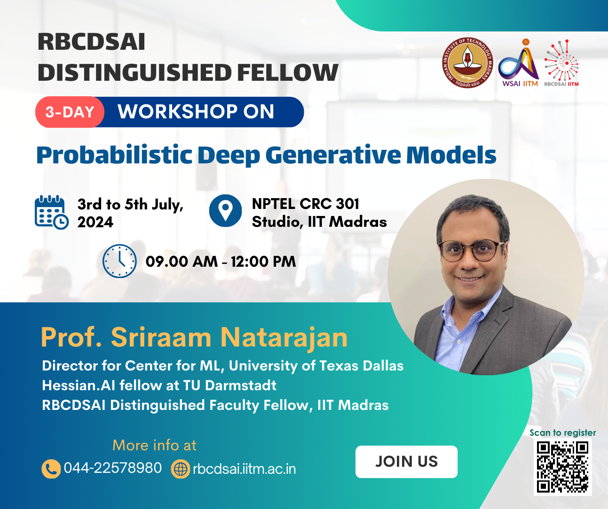

# Probabilistic Deep Generative Models Workshop

This repository contains the materials for the **Probabilistic Deep Generative Models Workshop** held at IIT Madras, July 3-5 2024.

## Overview
This workshop aims to introduce participants to Deep and Tractable Probabilistic Generative Models, a special class of generative models that balance expressiveness and tractability. Participants will learn about their theoretical foundations, practical implementations, and real-world applications.

## Workshop Schedule

**Date:** July 3-5, 2024

**Organizers:**
- Robert Bosch Centre for Data Science and Artificial Intelligence (RBCDSAI)
- Wadhwani School of Data Science & AI (WSAI) 
- IIT Madras

**Presenters:**
- [Sriraam Natarajan](https://personal.utdallas.edu/~sriraam.natarajan/)
- [Sahil Sidheekh](https://sahilsid.github.io/)

**Day 1: Foundations of Probabilistic Generative Models**
- Introduction to probabilistic models, their importance and applications
- Overview of traditional probabilistic graphical models
- Inference and Learning in graphical models

**Day 2: Probabilistic Circuits as Expressive and Tractable Generative Models**
- Popular generative models & their tractability for probabilistic inference
- Probabilistic Circuits: Representation and Inference
- Learning Probabilistic Circuits
- Hands on Demo

**Day 3: Advanced Topics and Applications**
- Deep Probabilistic Circuits
- Hands on Demo
- Applications of Deep Tractable Probabilistic Models

## Resources
- [Slides](https://drive.google.com/file/d/1SrheoXk8fkO0moM7Kb5PfrTuCGCcROfB/view?usp=sharing)
- Hands-On Code Demos
  - Day 2: [Building Simple Probabilistic Circuicts with SPFlow](https://bit.ly/pdgm-1)
  - Day 2: [Einsum Networks: Deep Tensorized PCs in Pytorch](https://bit.ly/pdgm-2)
  - Day 3: [Implementing a simple Normalizing Flow](https://bit.ly/pdgm-3)
  - Day 3: [Demo of Probabilistic Flow Circuits](https://bit.ly/pdgm-4)

## Contact
For any queries, please contact the organizers:
- **Robert Bosch Centre for Data Science and Artificial Intelligence (RBCDSAI), IIT Madras**
  - Email: rbcdsai@iitm.ac.in
  - Website: [RBCDSAI](https://rbcdsai.iitm.ac.in/)
